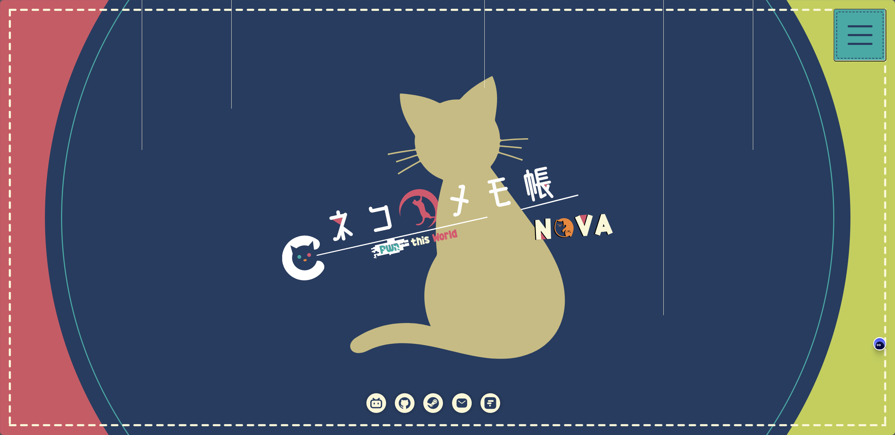

  
   

# MuelNova Blog

_✨ MuelNova [博客](https://nova.gal)的备份 ✨_

> :rocket: This README.md is still editing.

## 友情链接

如果你想要让你的友链也出现在这上面，你可以通过以下几种方式：

### Discussion

在 [讨论](#18) 里回复

### Pull Request

对 [\_linksVals.tsx](src/pages/links/_linksVals.tsx) 进行修改并且提交 PR

 

如果你想要让我在你的友链中出现的话，
请使用 [这个文件](src/static/img/nova-logo-par.png) 作为 LOGO
博客地址为 [https://nova.gal](https://nova.gal)
